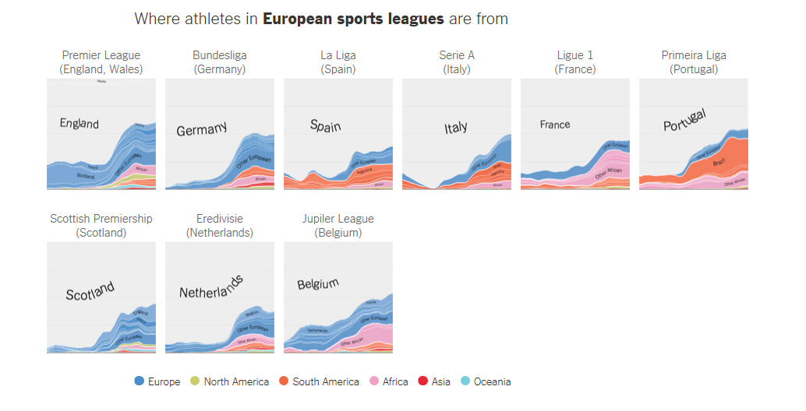
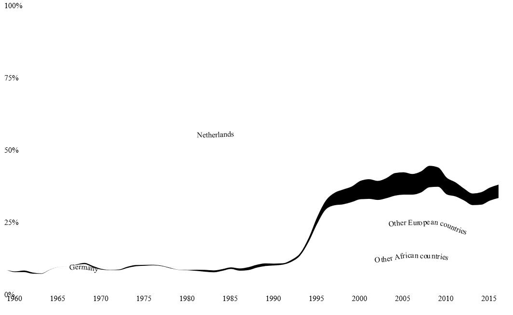
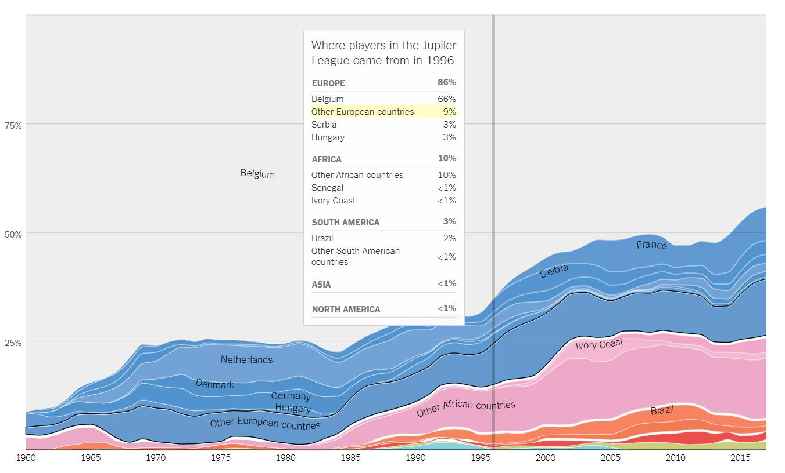
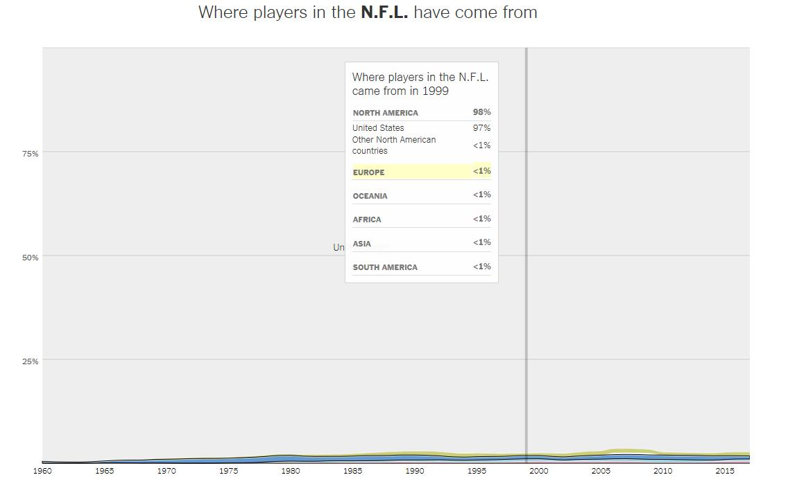
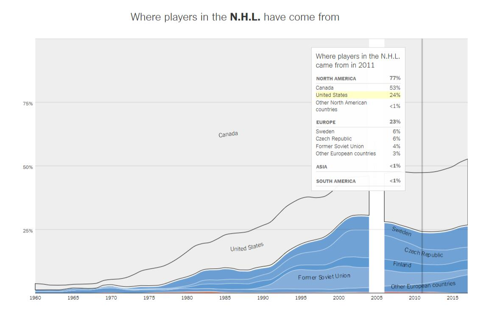
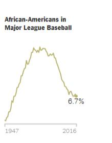
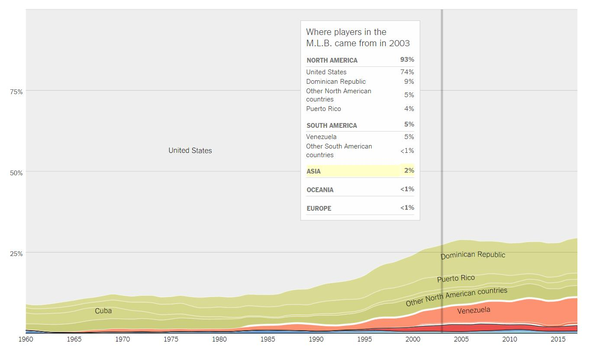
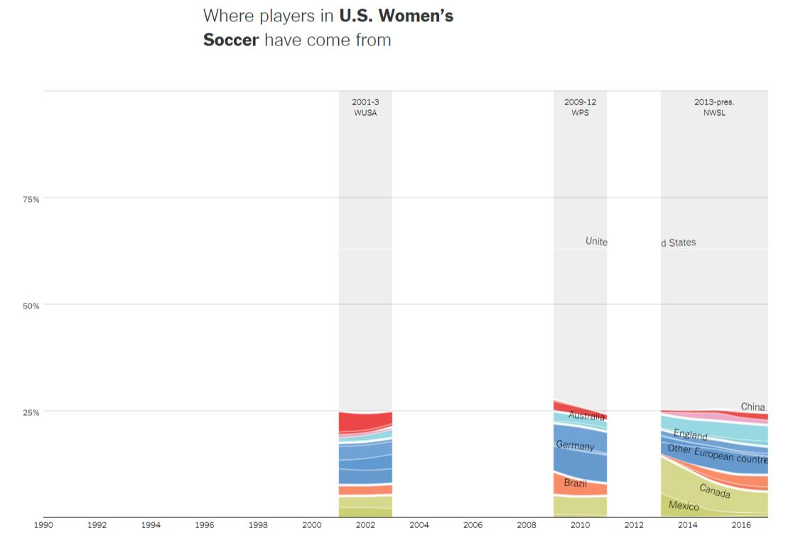

# Where Athletes in the Premier League, the N.B.A and Other Sports Leagues Come From, in 15 Charts

Hi there, I'm Yang Hao!

I will use this webpage to present my viewer's choice topic.

## Link to the topic

<a href="https://www.nytimes.com/interactive/2017/12/29/upshot/internationalization-of-pro-sports-leagues-premier-league.html#wfn-england-premier-league" style="color:blue">https://www.nytimes.com/interactive/2017/12/29/upshot/internationalization-of-pro-sports-leagues-premier-league.html#wfn-england-premier-league</a>

## Introduction to the visualization
More and more data and evidences show that the composition of athletes in most of the top professional sports leagues becomes more and more international.

This interactive visualization shows where athletes in 15 of the best-known professional leagues come from. The data is about players' birthplace in 15 leagues along years. Those 9 top European leagues are  the Jupiler League, Premier League, Ligue 1, Bundesliga, Serie A, Eredivisie, Primeira Liga, Scottish Premiership, La Liga. And 6 American and Canadian sports leagues are M.L.B., N.B.A., N.H.L, N.F.L., M.L.S., U.S. Women's Soccer.
			
There are 15 Stacked Area Charts. Stacked area charts are good choice for this project. It lets you see categorical data over time. Interaction allows you to focus on specific categories without losing sight of the big picture.

**Features:**

- Arrange more than one d3.js graph on a web page. Take the graph for european leagues as example. It combines 9 graphs together. The plot below shows svg image of one stacked area chart. 

- It gives a broad view of the topic developing over years. You can get different groups' share together and make comparison. You will get inspired by the change of share over time. 

- It uses annotations and highlight ranges to add explanations to charts. It makes data for seperate group outstanding and interactive. It also helps readers to figure out more details about the chart.
	
- It turns off automatic labeling and places its own's labels.

- Leagues rules or laws can make the trend change. And there are elements to mark them in charts. It makes data more interesting and intuitive.

## Discussion

**What is the data? And how it is collected?**

To track the trend of the movement, charts are plots on birthplace of players, who are from 15 of the best-known leagues in the United States, Canada and Europe. 

The table below shows you where the data comes from and what is it.

|League         	  		   | Link	               | 
| ---------------------------- |:---------------------:| 
| National Football League      | [Pro Football Reference](https://www.pro-football-reference.com/)| 
| National Basketball Association      | [Basketball Reference](https://www.basketball-reference.com/teams/BOS/1961.html)        |   
| National Hockey League | [Hockey Reference](https://www.hockey-reference.com/)       |    
| Major League Baseball | [Baseball Reference](https://www.baseball-reference.com/) & [Racial Composition](https://sabr.org/bioproj/topic/baseball-demographics-1947-2012)    |     
|Wmen’s professional soccer (W.P.S., WUSA, N.W.S.L.)|[Roster data](https://issuu.com/jendesignhouston/docs/nwsalmanac.fall2016.sample) |  
|Men’s soccer leagues in Europe and North America|[Worldfootball.net](http://www.worldfootball.net/)|

The most reliable sources for American sports tend to list a player’s birthplace, while those for international soccer describe a player’s nationality. Most players are born in the country in which they have citizenship; the possibility of a small number of mismatches between birthplaces and nationality does not change the overall picture much.

**What works and what needs improvement?**

Pros:

- It selects the stacked area chart to group values of many catagories. It focuses on the overall trends and how they changes by group on shares instead of absolute values. And it is good choice in this case because there have many dates. 

- It considers grouping many tiny values together to one bigger value(e.g. "others european countries and african countries") to clean up the overall look of the chart. You will need fewer labels, which will help your readers to navigate themselves faster on the chart.

- It turns off automatic labeling and places its own's labels. readers will be able to read the chart faster thanks to that. 

- Similiar groups are combined and sorted. They are also colored by color groups. The baseline is consistant for the whole topic. Take the chart for German leagues as an example. Countries from same continent are painted in similiar color groups. It is pretty good for reading quickly. 
![german.jpg]

Cons:

- Area charts don't work good for considerably small differences between your values. The trend is hard to be seen well enough on an area chart. For N.F.L plot, we can easily see the shortcoming because players from North American dominate in leagues. The trends for players from outside North American is hard to be observed for readers when stacked area chart is used. 

- Bright color used in some charts can attract readers' focus. However it isn't any special important value. It makes charts harder to read.

- The discrepancy arises because the chart plots the market share vertically, but we perceive the thickness of a stream at right angles to its general direction.

- There are too many charts for the topics. It is inconvenient to pick interested chart quickly. If more tab menues can be applied to organize these charts, it will be better. 

**Who are the users that this visualization was made for?**

- Decision makers in leagues. There may be some correlation between player diversity and team results in competition. There is some studies showing the benefits of diversity on the playing field or ditch as it's known in games. 

- Researchers and journalists who is interested in sport related field. The topic provides comprehensive resource for issues related to countries and race in athlete. It's a reflection of which countries have deep talent pool and are investing in some related sport a lot. 

- Some sociology researcher who is interested in the race composition of players in leagues. The report address some issues on some significant shift in the race composition in US leagues.

- Some decision makers in the sport related industries. 

**What questions do people want to ask?**

- According to datas in american and canadian sports leagues, what is the relation between the changing composition of the league and the trend of the interest of fans? 

- Why there is a share decline in African American players in some sports?

- According to compositon of women's professional soccer in the U.S., We can see that there have a few gaps. What happened on the trend of other foreign countries where foreigners came from? 

**How can they find the answers with this tool?**

- The changes of the composition reflect the trend of the new fans. The trend of charts on the composition are very consistant . It provides a great views for them. The conclusion also works for Hockey Leagues and the interest of the sport. 

- It may be because the trend of fans changes. When baseball was national pastime of the United States, majority of players were american. However, it changed a lot when interest in baseball becomes strong in Latin American. Then more international players join the baseball leagues. Alongside this growth among latin Americans, there is a sharp decline in participation among African-Americans. 

-Women’s professional soccer has had fits and starts in the U.S., with two previous leagues – the Women’s United Soccer Association and Women’s Professional Soccer – both folding after a few seasons. the composition of women’s pro soccer in the U.S. has been relatively consistent: largely Americans, with foreigners coming mostly from Europe and Canada.

